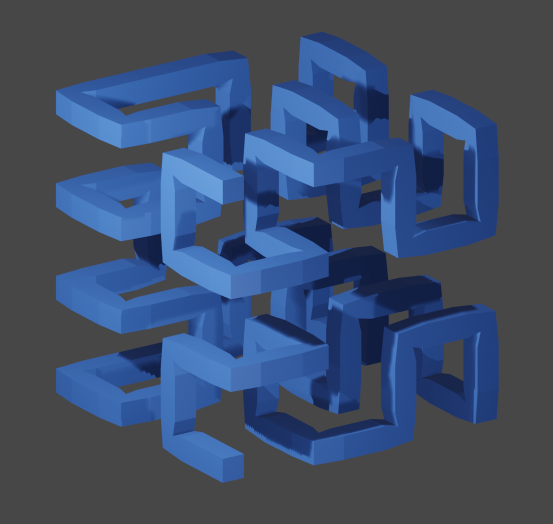
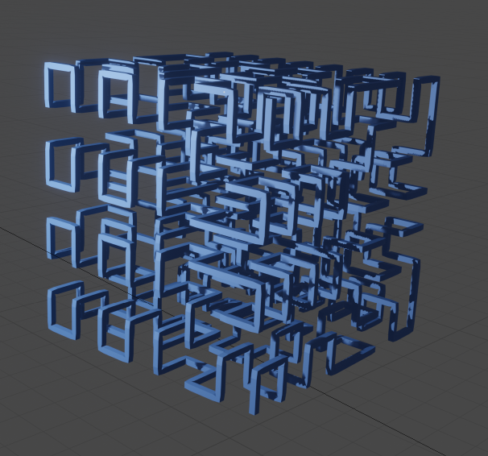
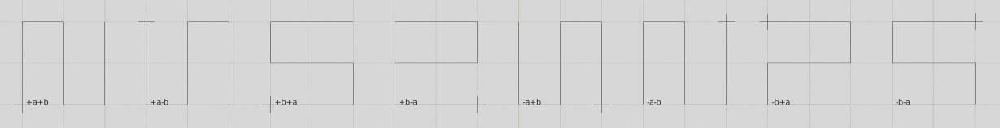
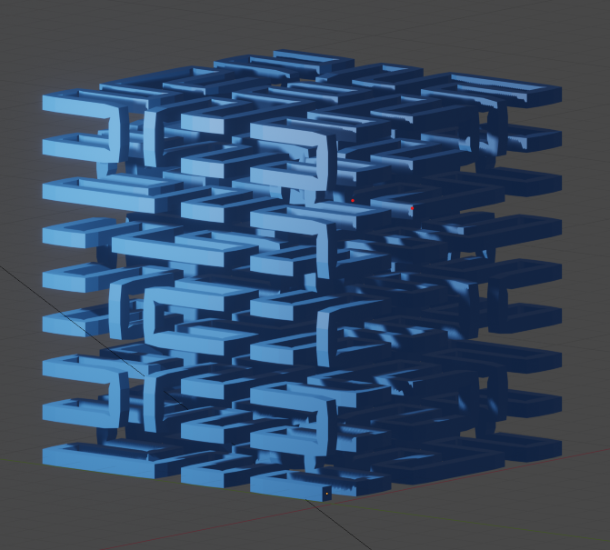
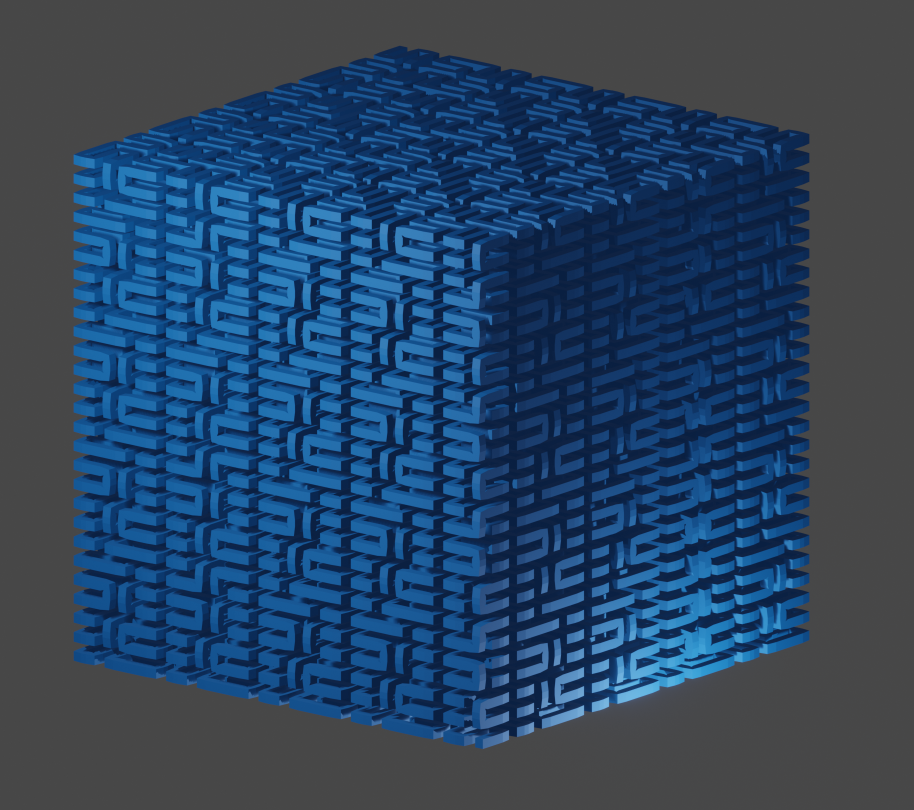
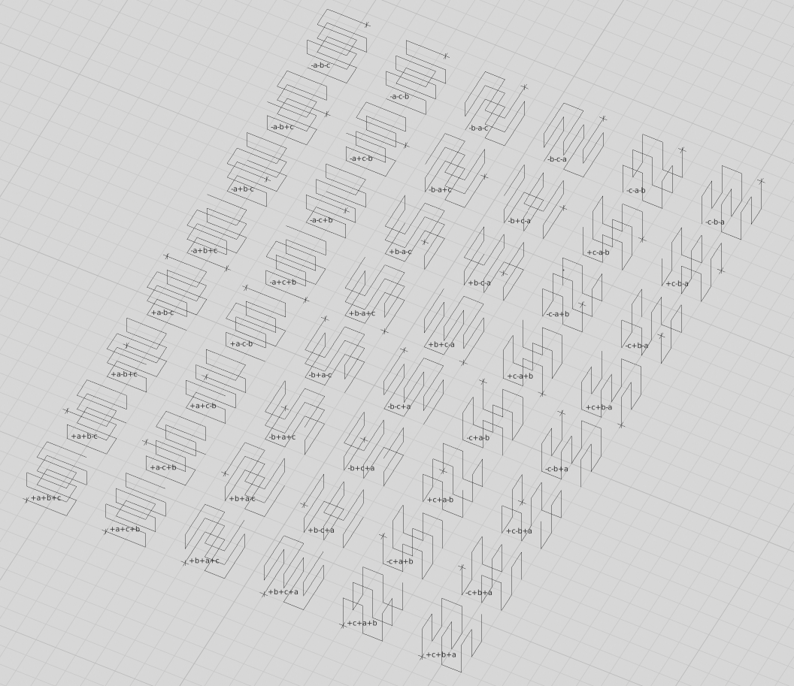

# **Hilbert + Peano + 2D + 3D + Python + Script + Blender**

## **Hilbert**
  
hilbert 2d, iteration 3

  
hilbert 3d, iteration 2

  
hilbert 3d, iteration 3

## **Peano**
  
peano 2d, variation 0, iteration 1, 8 possibilities

  
peano 2d, variation 0, iteration 3

  
peano 3d, variation 0, iteration 2

  
peano 3d, variation 0, iteration 3

  
peano 3d, variation 0, iteration 1, 48 possibilities

## **Remarks**
larger images in image drawer

## **Versions**
\- 0.9 initial  

---

#### contact
[qrt@qland.de](mailto:qrt@qland.de)
