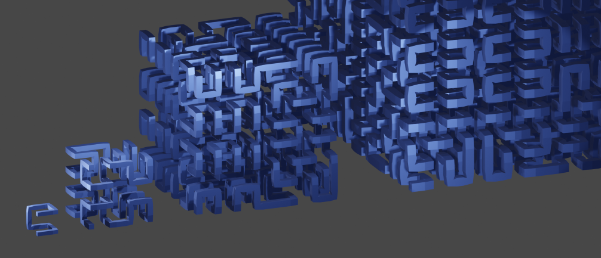
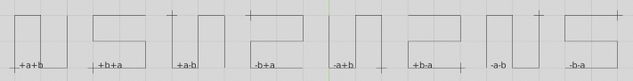

# **Hilbert + Peano + 2D + 3D + Python + Script + Blender**

## **Hilbert 2D**

  
hilbert 2d, variation 0, iteration 1, 8 possibilities

```
def hilbert2d(s, x, y, a, b):
    if s == 1:
        draw(x, y, 0)
        return

    s >>= 1

    x, y, _ = a.cor(s, x, y)           
    x, y, _ = b.cor(s, x, y)

    hilbert2d(s, x,             y,              b,  a)
    hilbert2d(s, x+s*b.x,       y+s*b.y,        a,  b)
    hilbert2d(s, x+s*(a.x+b.x), y+s*(a.y+b.y),  a,  b)
    hilbert2d(s, x+s*a.x,       y+s*a.y,       -b, -a)
```

\- s is the iteration variable, it has to start as a power of 2 and is halved with every subroutine call, if it reaches 1 the current points and edges are drawn and the recursion stops  
\- the coefficients after x and y parameters are the blueprint of the curve, every tile consists of 4 points, in this example the +a+b possibility is used as blueprint, see table above  
\- a and b parameters after x and y fields vary the blueprint for the next iteration, start point (marked) and end points must fit together, see table above  
\- a and b parameters correlate to x and y tile point positions  
\- cor method calls correct the position of the tiles in case they have negative offsets, as it is a 2D curve z coordinates are discarded

  
hilbert 2d, variation 0, iteration 1-3

## **Hilbert 3D**

  
hilbert 3d, variation 0, iteration 1, 48 possibilities

```
def hilbert3d(s, x, y, z, a, b, c):
    if s == 1:
        draw(x, y, z)
        return

    s >>= 1
    
    x, y, z = a.cor(s, x, y, z)         # correction factor 1
    x, y, z = b.cor(s, x, y, z)
    x, y, z = c.cor(s, x, y, z)

    hilbert3d(s, x,                 y,                 z,                  b,  c,  a)
    hilbert3d(s, x+s*a.x,           y+s*a.y,           z+s*a.z,            c,  a,  b)
    hilbert3d(s, x+s*(a.x+b.x),     y+s*(a.y+b.y),     z+s*(a.z+b.z),      c,  a,  b)
    hilbert3d(s, x+s*b.x,           y+s*b.y,           z+s*b.z,           -a, -b,  c)
    hilbert3d(s, x+s*(b.x+c.x),     y+s*(b.y+c.y),     z+s*(b.z+c.z),     -a, -b,  c)
    hilbert3d(s, x+s*(a.x+b.x+c.x), y+s*(a.y+b.y+c.y), z+s*(a.z+b.z+c.z), -c,  a, -b)
    hilbert3d(s, x+s*(a.x+c.x),     y+s*(a.y+c.y),     z+s*(a.z+c.z),     -c,  a, -b)
    hilbert3d(s, x+s*c.x,           y+s*c.y,           z+s*c.z,            b, -c, -a)
```

\- the blueprint is a little longer because every tile consists of 8 points but same principle as before  
\- to a and b parameters a c parameter for z coordinates is added  
\- in cor method calls the optional correction factor is omitted because it is 1 for 1 x 1 x 1 spatial expanse of 3D hilbert tiles

  
hilbert 3d, variation 0, iteration 1-4

## **Peano 2D**

  
peano 2d, variation 0, iteration 1, 8 possibilities

```
def peano2d(s, x, y, a, b):
    if s == 1:
        draw(x, y, 0)
        return

    s //=  3

    x, y, _ = a.cor(s, x, y, f=2)           # correction factor 2
    x, y, _ = b.cor(s, x, y, f=2)

    peano2d(s, x,               y,                a,  b)
    peano2d(s, x+s*b.x,         y+s*b.y,         -a,  b)
    peano2d(s, x+s*2*b.x,       y+s*2*b.y,        a,  b)
    peano2d(s, x+s*(a.x+2*b.x), y+s*(a.y+2*b.y),  a, -b)
    peano2d(s, x+s*(a.x+b.x),   y+s*(a.y+b.y),   -a, -b)
    peano2d(s, x+s*a.x,         y+s*a.y,          a, -b)
    peano2d(s, x+s*2*a.x,       y+s*2*a.y,        a,  b)
    peano2d(s, x+s*(2*a.x+b.x), y+s*(2*a.y+b.y), -a,  b)
    peano2d(s, x+s*2*(a.x+b.x), y+s*2*(a.y+b.y),  a,  b)
```

\- the blueprint has 9 points now  
\- iteration variable s has to start with powers of 3 for peano curves, it is divided by 3 in every iteration  
\- the correction factor is set to 2 because the 2D peano curve tiles occupy a 2 x 2 field

  
peano 2d, variation 0, iteration 1-3

## **Peano 3D**

  
peano 3d, variation 0, iteration 1, 48 possibilities

```
def peano3d(s, x, y, z, a, b, c):
    if s == 1:
        draw(x, y, z)
        return

    s //= 3

    x, y, z = a.cor(s, x, y, z, 2)          # correction factor 2
    x, y, z = b.cor(s, x, y, z, 2)
    x, y, z = c.cor(s, x, y, z, 2)

    peano3d(s, x,                     y,                     z,                      b,  a,  c)
    peano3d(s, x+s*a.x,               y+s*a.y,               z+s*a.z,                a, -b, -c)
    peano3d(s, x+s*2*a.x,             y+s*2*a.y,             z+s*2*a.z,              b,  a,  c)
    peano3d(s, x+s*(2*a.x+b.x),       y+s*(2*a.y+b.y),       z+s*(2*a.z+b.z),       -a,  b, -c)
    peano3d(s, x+s*(a.x+b.x),         y+s*(a.y+b.y),         z+s*(a.z+b.z),         -b, -a,  c)
    peano3d(s, x+s*b.x,               y+s*b.y,               z+s*b.z,               -a,  b, -c)
    peano3d(s, x+s*2*b.x,             y+s*2*b.y,             z+s*2*b.z,              b,  a,  c)
    peano3d(s, x+s*(a.x+2*b.x),       y+s*(a.y+2*b.y),       z+s*(a.z+2*b.z),        a, -b, -c)
    peano3d(s, x+s*2*(a.x+b.x),       y+s*2*(a.y+b.y),       z+s*2*(a.z+b.z),        b,  a,  c)
    
    peano3d(s, x+s*(2*a.x+2*b.x+c.x), y+s*(2*a.y+2*b.y+c.y), z+s*(2*a.z+2*b.z+c.z), -a, -b,  c)
    peano3d(s, x+s*(a.x+2*b.x+c.x),   y+s*(a.y+2*b.y+c.y),   z+s*(a.z+2*b.z+c.z),    b, -a, -c)
    peano3d(s, x+s*(2*b.x+c.x),       y+s*(2*b.y+c.y),       z+s*(2*b.z+c.z),       -a, -b,  c)
    peano3d(s, x+s*(b.x+c.x),         y+s*(b.y+c.y),         z+s*(b.z+c.z),         -b,  a, -c)
    peano3d(s, x+s*(a.x+b.x+c.x),     y+s*(a.y+b.y+c.y),     z+s*(a.z+b.z+c.z),      a,  b,  c)
    peano3d(s, x+s*(2*a.x+b.x+c.x),   y+s*(2*a.y+b.y+c.y),   z+s*(2*a.z+b.z+c.z),   -b,  a, -c)
    peano3d(s, x+s*(2*a.x+c.x),       y+s*(2*a.y+c.y),       z+s*(2*a.z+c.z),       -a, -b,  c)
    peano3d(s, x+s*(a.x+c.x),         y+s*(a.y+c.y),         z+s*(a.z+c.z),          b, -a, -c)
    peano3d(s, x+s*c.x,               y+s*c.y,               z+s*c.z,               -a, -b,  c)

    peano3d(s, x+s*2*c.x,             y+s*2*c.y,             z+s*2*c.z,              b,  a,  c)
    peano3d(s, x+s*(a.x+2*c.x),       y+s*(a.y+2*c.y),       z+s*(a.z+2*c.z),        a, -b, -c)
    peano3d(s, x+s*2*(a.x+c.x),       y+s*2*(a.y+c.y),       z+s*2*(a.z+c.z),        b,  a,  c)
    peano3d(s, x+s*(2*a.x+b.x+2*c.x), y+s*(2*a.y+b.y+2*c.y), z+s*(2*a.z+b.z+2*c.z), -a,  b, -c)
    peano3d(s, x+s*(a.x+b.x+2*c.x),   y+s*(a.y+b.y+2*c.y),   z+s*(a.z+b.z+2*c.z),   -b, -a,  c)
    peano3d(s, x+s*(b.x+2*c.x),       y+s*(b.y+2*c.y),       z+s*(b.z+2*c.z),       -a,  b, -c)
    peano3d(s, x+s*2*(b.x+c.x),       y+s*2*(b.y+c.y),       z+s*2*(b.z+c.z),        b,  a,  c)
    peano3d(s, x+s*(a.x+2*b.x+2*c.x), y+s*(a.y+2*b.y+2*c.y), z+s*(a.z+2*b.z+2*c.z),  a, -b, -c)
    peano3d(s, x+s*2*(a.x+b.x+c.x),   y+s*2*(a.y+b.y+c.y),   z+s*2*(a.z+b.z+c.z),    b,  a,  c)
```

\- a piece of work, the blueprint has 27 points for peano 3D tiles  
\- correction factor 2 for 2 x 2 x 2 tile space 

  
peano 3d, variation 0, iteration 1-3

## **Remarks**
\- only one possible variation for hilbert and peano 2D and 3D curves is completed here  
\- the source contains commented out drawing routines to array other possible variations  
\- the clean edges routine gets rid of construction points on edges, in some cases they might be useful and the routine has to be commented out  
\- some larger images in image/large

## **Versions**
\- 0.9 initial  

---

#### contact
[qrt@qland.de](mailto:qrt@qland.de)
